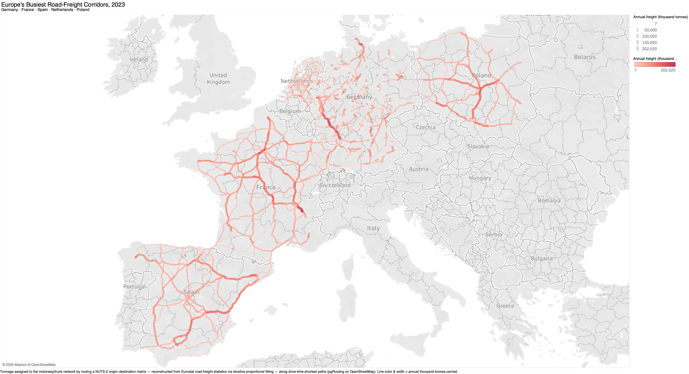

# Freight Corridor Analyzer

**Where does freight actually move across Europe?** This project reconstructs the busiest long-distance road-freight corridors across five of Europe's largest freight economies (Germany, France, Spain, the Netherlands, and Poland) from real Eurostat data, and draws them on the real road network.

It extends an earlier project, **Green Miles**, which stopped at national tonnage totals. This one turns those totals into a routable, region-to-region view of the corridors themselves.

## What you're looking at



*Motorway and trunk segments, coloured and sized by the annual tonnes they carry. The Germany–Netherlands (Rhine–Randstad) and Germany–Poland corridors dominate; Spain concentrates its flow onto a sparse autovía skeleton.*

Every road segment is weighted by how much freight passes over it in a year. Thick, hot lines are the arteries; thin, cool lines are quieter roads. The busiest corridors emerge on their own, without anyone labelling them.

## What it found (2023)

Germany is the freight heart of the continent. It has the largest domestic market (roughly 2.6 billion tonnes a year) and sits at the top of every cross-border pair, radiating along the Rhine–Randstad axis to the Netherlands and eastward to Poland.

| Corridor | Million tonnes / year |
| --- | --- |
| Germany ↔ Netherlands | 42.5 / 40.9 |
| Poland ↔ Germany | 37.8 / 31.5 |
| Spain ↔ France | 26.7 / 23.0 |

The map also exposes a structural contrast. **Spain** pushes about 1.45 billion tonnes a year through a *sparse* motorway skeleton, so a handful of roads carry heavy load and burn hot. **France** spreads a similar volume across a *denser* grid, so no single segment dominates.

One more thing the data shows: freight concentrates hard onto the fast network. Of the 1.4 million road segments, only 267k carry any load when routing by drive time, versus 409k when routing by pure distance. Trucks favour motorways enough that the corridors stand out sharply.

## The interesting problem: this data doesn't exist

Eurostat publishes **no origin–destination matrix** for road freight. For statistical-confidentiality reasons, you can see how much each region *loads* and *unloads*, and how much moves between *countries*, but not which region ships to which region.

I could have invented a plausible matrix. I didn't want to, because a portfolio piece built on fabricated inputs proves nothing. So instead of simulating the data, I **reconstructed** it from the totals Eurostat does publish, using iterative proportional fitting (IPF): a standard, citable method that fills in a region-to-region grid so that it agrees with every real total we have. Real inputs, documented method, honest output.

Three published tables feed the reconstruction:

- `road_go_ta_rl` — tonnes loaded, by region
- `road_go_ta_ru` — tonnes unloaded, by region
- `road_go_ia_rc` — international tonnes, by country pair

The domestic diagonal (freight staying inside a country) is derived as `loaded_total − international_outbound`, so it too depends only on published tables rather than a fourth confidential source.

## How it's built

Three Airflow pipelines, each doing one job:

1. **Demand** (`freight_assignment`) pulls and cleans the three Eurostat tables, reconstructs the NUTS-2 origin–destination matrix via IPF, checks the fit, and loads it to Postgres. On the 2023 vintage this is a 13,456-pair matrix across 116 regions, with IPF closing all three sets of constraints to a residual of 2e-10.
2. **Network** (`build_network`) downloads the five OpenStreetMap country extracts, filters them to the motorway/trunk/primary layer, and loads a routable graph (about 1.4 million edges) into PostGIS with pgRouting.
3. **Routing** (`route_freight`) snaps each region to its nearest network node, routes every origin–destination flow along the drive-time-shortest path, and sums the tonnage crossing each road segment. That per-segment total is the "most-used corridors" layer.

The routing pipeline reruns automatically whenever the network is rebuilt, using an Airflow Asset rather than a fixed schedule.

## Honest caveats

- These flows are an IPF **reconstruction** from published marginals, not measured movements.
- Each region is represented by a single network access node, so tonnage funnels along its egress path (a standard centroid-connector artifact). The corridor map is therefore drawn on the motorway/trunk layer, where the signal is clean.
- Region granularity is NUTS-2 in this version. NUTS-3 is a documented next step.

*Source: Eurostat road freight (`road_go_ta_rl`, `road_go_ta_ru`, `road_go_ia_rc`), 2023; road network © OpenStreetMap contributors.*

---

# Technical reference

## Pipeline detail

`dags/freight_assignment.py` (Airflow TaskFlow DAG):

1. `stage_eurostat` — pull the three JSON-stat tables, clean, aggregate NUTS-3 → NUTS-2, write to parquet (`src/stage_clean.py`)
2. `ipf_reconstruct` — run IPF against the three marginals to build the O-D matrix (`src/ipf.py`)
3. `validate_od` — fail the run if the matrix is empty or IPF didn't converge within `MAX_MARGINAL_ERROR`
4. `load_od` — upsert into Postgres, keyed by vintage year (skipped if `FREIGHT_DB_URI` is unset)

Tasks pass parquet paths between each other, not XCom payloads.

`dags/build_network.py`:

1. `download` — pull each of the five Geofabrik country extracts (`.osm.pbf`)
2. `filter_country` — `osmium tags-filter` down to motorway/trunk/primary ways per country
3. `merge` — `osmium merge` the five filtered extracts into one network
4. `load` — convert the merged PBF to OSM XML (`osmium cat`), then `osm2pgrouting` loads it into PostGIS and builds the routable topology (`ways`, `ways_vertices_pgr`). osm2pgrouting parses OSM XML, not PBF, hence the conversion; its 3.x schema keys edges by `id`/`geom` (older 2.x used `gid`/`the_geom`), which the routing SQL targets.

The `load` task declares `Asset("postgres://network/ways_topology")` as an outlet, so the routing DAG schedules off that asset instead of a cron. (In Airflow 3.x this is the `Asset` API; the older 2.x `Dataset` name no longer exists.) `src/network.py` keeps the `osmium` / `osm2pgrouting` invocations as pure command builders (`filter_cmd`, `merge_cmd`, `osm2pgrouting_cmd`) so they are unit-testable without running the binaries.

`dags/route_freight.py`, scheduled off `Asset("postgres://network/ways_topology")`:

1. `map_centroids` — pull NUTS-2 region polygons from Eurostat GISCO, load them into PostGIS, then snap each region's centroid to its nearest routable vertex via a KNN (`<->`) query
2. `route` — `pgr_dijkstra` (one-to-many) over every snapped O-D pair for the target vintage, expanding each shortest path to the edges it traverses and attaching that pair's tonnage. Edges are weighted by drive time (`cost_s` / `reverse_cost_s`), which already carry the one-way sign
3. `edge_loads` — sum tonnage per edge into `edge_loads` (edge geometry + total tonnes), the routable "most-used corridors" layer for Tableau

The vintage routed defaults to the `freight_processed_vintage` Airflow Variable set by `freight_assignment.load_od` (override with `params.vintage`). `src/routing.py` keeps every SQL statement in pure builder functions (`centroid_nodes_sql`, `route_od_sql`, `edge_loads_sql`) so they are unit-testable.

> The O-D matrix (`freight_od_matrix`) and the routable network (`ways` / `ways_vertices_pgr`) must live in the **same** database, since routing joins them in SQL. Point `FREIGHT_DB_URI`, `NETWORK_DB_URI`, and `ROUTING_DB_URI` at one PostGIS+pgRouting warehouse in a real deployment.

## Setup

```
python -m venv .venv && source .venv/bin/activate
pip install -r requirements.txt
```

`build_network` additionally requires the `osmium` (osmium-tool) and `osm2pgrouting` CLI binaries on PATH, and a PostGIS database with the pgRouting extension enabled. None of these are pip-installable, so install them via your OS package manager (e.g. `brew install osmium-tool osm2pgrouting`, or `apt-get install osmium-tool osm2pgrouting`).

## Tests

```
pytest
```

`tests/` wraps the self-checks embedded in `src/ipf.py` and `src/stage_clean.py` (run those files directly for the same checks with printed output).

### Routing integration check

The unit tests cover the SQL builders as strings but never touch a database. `tests/test_routing_pg.py` runs the real `snap_centroids` → `route_od_pairs` → `compute_edge_loads` chain against a live PostGIS + pgRouting database, using a tiny synthetic graph it seeds itself (no OSM download needed). It **skips** unless `ROUTING_IT_DB_URI` is set.

On a Mac with Homebrew `postgresql@17` + `postgis` + `pgrouting`:

```
./scripts/run_integration.sh
```

It spins up a throwaway cluster on port 5433, enables the extensions, runs the test, and tears the cluster down again.

## Environment variables

- `FREIGHT_DATA_DIR` — parquet staging directory (default `/tmp/freight`)
- `FREIGHT_DB_URI` — Postgres URI for the `load_od` task; load is skipped if unset
- `NETWORK_DATA_DIR` — OSM extract staging directory (default `/tmp/network`)
- `NETWORK_DB_URI` — PostGIS URI for `osm2pgrouting`; `build_network`'s `load` task raises if unset
- `NETWORK_MAPCONFIG` — path to the osm2pgrouting tag-mapping XML (default `/usr/share/osm2pgrouting/mapconfig.xml`; on macOS/Homebrew, `/opt/homebrew/opt/osm2pgrouting/share/osm2pgrouting/mapconfig.xml`)
- `ROUTING_DB_URI` — database for `route_freight` (falls back to `NETWORK_DB_URI`); must hold both `freight_od_matrix` and the network tables
- `NUTS_YEAR` — GISCO NUTS classification vintage for region geometry (default `2021`)

## Visualization (Tableau)

The map is built from the **motorway + trunk** slice of `edge_loads`. Primary segments near region centroids carry a centroid-connector artifact, so they are excluded; the corridor signal is clean on the motorway/trunk network.

`src/export_corridors.py` writes that slice to a GeoJSON `FeatureCollection` (one `LineString` per edge, with `tonnes`, `road_class`, `name`) that Tableau opens natively:

```
python src/export_corridors.py "<db_uri>" corridor_loads_2023.geojson   # optional 3rd arg: min tonnes to trim
```

For the five-country 2023 run this is about 145k features / 32 MB. Pass a `min_tonnes` threshold (e.g. `20000`) for a lighter, busier-corridors-only file.

For a faint grey backdrop, export the dissolved base network (2 features, ~3 MB):

```
python src/export_corridors.py "<db_uri>" network_base.geojson --base
```

In Tableau: **Connect → To a File → Spatial file**, pick the `.geojson`, drag **Geometry** onto the view, put **tonnes** on **Color** and **Size**, and use **road_class** as a filter with **name** in the tooltip. Busiest routes render thick and hot.
